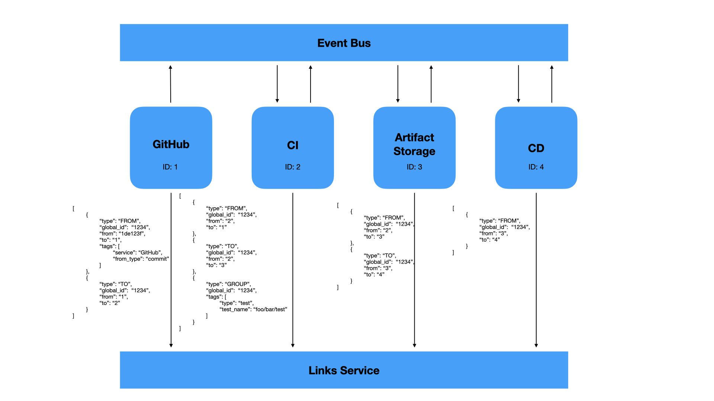

# Connecting Events - Links Proposal

## Abstract

This proposal will outline how to connect individual CDEvents to eachother.
Right now there's no way of associating events to one another without needing
to backtrack across certain context attributes, eg
[id](https://github.com/CDEvents/spec/blob/main/spec.md#id-context).  While
that does give us the ability to construct some graph, we do not know when a
particular span starts or finishes.

This proposal will outline a new approach that will allow for connecting
CDEvents to one another and give a clear distinction of when an activity span start and
finishes.

## Semantics

This section will line out various definitions to ensure there are no
assumptions being made when we talk about linking events

* **CI** - Continuous integration
* **CD** - Continuous delivery
* **Activities Span** - An activities span is an end to end representation of all activities performed in the
  CI/CD lifecycle of some entity
* **Link** - A link is some relation to some thing, eg event, grouping, etc.
* **Global ID** - A global ID is some overarching ID for a given span.

## Goals

The biggest challenge in this whole process is ensuring that links can be
retrieved quickly and efficiently, while also providing the necessary metadata
and structure to give a detailed picture of how things occurred.

1) Provide a way of quickly retrieving all related links
2) Keep link data structured small and simple
3) Scalable

## Design

This section will propose two designs. The first being how individual events
can be linked to one another and be described in a way where it represents the
complete picture of the whole CI/CD span. The second portion will address the
goal of scalability.

### New Headers

To allow for connecting events and proper propogation, we will add two new HTTP
headers:
* `X-CDEVENTS-GLOBAL-ID`
* `X-CDEVENTS-PARENT-IDS`

The reasoning for using headers in addition to  adding new fields to the
payload, is that some services may not be adhering to CDEvents.  It is
generally easier for a service to enable certain headers to be forwarded than
needing to adapt or restructure some payload to accomodate some standard like
CDEvents.

```json
# Headers
# X-CDEVENTS-GLOBAL-ID: "00000000-0000-0000-0000-000000000001"
# X-CDEVENTS-PARENT-IDS: "271069a8-fc18-44f1-b38f-9d70a1695819"

{
  "context": {
    "version": "0.3.0-draft",
    "id": "505b31c2-8bc8-47b3-a1a0-269d7a8530ac",
    "source": "dev/jenkins",
    "type": "dev.cdevents.testsuite.finished.0.1.1",
    "global_id": "00000000-0000-0000-0000-000000000001", # new global id field
    "parent_id": "271069a8-fc18-44f1-b38f-9d70a1695819", # new parent id field
    "timestamp": "2023-03-20T14:27:05.315384Z"
  },
  "subject": {
    "id": "MyTestSuite",
    "source": "/tests/com/org/package",
    "type": "testSuite",
    "content": {}
  }
}
```

Since consuming services will only have the parent IDs, it is important that
the service fetches the parent whem it requires more context

## IDs

With the introduction of the two headers, it's important to establish what they
are and their respective formats.

The `X-CDEVENTS-GLOBAL-ID` is an ID that is generated when a new CDEvent span
is wanted or if no CDEvent span is present. This ID will follow the [UUID](https://datatracker.ietf.org/doc/html/rfc4122)
format.

The `X-CDEVENTS-PARENT-IDS` is any number of immediate parent IDs to satifisy
the fan out, fan in use case. These IDs will be the IDs of the `context.id` in
the CDEvent which is of the UUID format.

## Client APIs and Links Storage

So far we've only talked about what a service may receive when expecting a
parent link. However, when we store a link, there's a lot more metadata that
can and should be added.

The idea is we'd expect users to start link, group, and end links accordingly
through APIs we'd provide. This is very similar to how tracing works.
Granularity in tracing is completely up to the engineer which this proposal
also intends users to do.

This will introduce new APIs to the CDEvents SDKs, such as `addLink`.
This API will be used to create a new link based on some CDEvent context.
The context may contain things like parent caller and other useful metadata.

```
(context: CDEventContext) addLink(link)
```

startLink will utilize the parent ID to make some sort of relation back to the
parent.
This method is attached to the LinkContext which will contain the current
metadata about the current composed of link, eg what current link is being
built along with the parent link ID.

When calling `addLink`, it is important to understand the association to the
parent.

```
// Adds a new link to the CDEvent context which will be sent to the link
// service at some point.
cdEventContext.addLink(link: Link);
// Link may be a class that can be a ToLink, FromLink, WithLink
```

Here we see an enum of `CAUSE` which is one of the few types of relations that
a link can have.
Below defines the list of enums a relation can be

| Name  | Description                                         |
|-------|-------------------------------------------------------------------------------------------|
| TO  | When a link is creating an event, it will use TO to signal to what target ID        |
| FROM  | When a link is receiving an event, it will use FROM to signal what service called it    |
| GROUP | When a link is to be grouped with other events, it will use GROUP to establish a grouping |

These links can be, but are not limited to, sent when a CDEvent has completed
to some collector or to the link service itself. Further the link service will
allow for tagging of various metadata.

For instance, a `WithLink` may be used with some test that is ran in our custom
pipeline called, `FooPipeline`. It runs a test suite, `BarSuite`, and runs tests `A`,
`B`, and `C`.

Assume our pipeline was triggered by some git website, which `FooPipeline`
would create a `FromLink` indicating the trigger from our git website. Further
at some point our pipeline decides to start the `BarSuite`. `BarSuite` would
add a new `WithLink` saying it's with the `FooPipeline`. We can keep going with
other `WithLink`s for each test, but each test will be "with"-ed the suite
instead of the pipeline. It's important to note when using the `GROUP` link
type, that links that are grouped under some `ID` will be grouped **under**
that event.

Some users may prefer to not run a separate links service especially if they
know their overall flow may only contain a few links. If that is the case,
simply turning on linking payload aggregation, will send all links in the
payload. Mind you, this can make the payload very large, but may be good for
debugging.

The global ID header will continue to propogate, unless the user explicitly
starts a new CDEvent span. If there is no global ID header, the client will
generate one and that will be used for the lifetime of the whole events span



This show's an example of how these different types would be used in a CI/CD setting.

## Links API
* `/links/{global id}`
  * `GET`
  * Returns a list of links associated with some global ID

  ```
  REQUEST
  ---
  {
    "maxLinks": ([0-9]+|null),
    "pagination_token": <some-pagination-token> # can be null for first page
  }

  RESPONSE
  ---
  {
    "global_id": <some UUID>,
    "token": <pagination token>, # used for second request to retrieve further pages
    "links": [
      ...
    ]
  }
  ```

* `/links`
  * `POST`
  * Uploads a series of created links.

  ```
  REQUEST
  ---
  {
    "links": [
      ...
    ]
  }
  ```

* `/links`
  * `GET`
  * Returns a list of links

  ```
  REQUEST
  ---
  {
    "pagination_token": "<some token>"
  }
  ```

* `/links/event`
  * `POST`
  * Adds a CDEvent to the links backend

  ```
  REQUEST
  ---
  {
    "event": {
      "context": {
        "version": "0.3.0-draft",
        "id": "505b31c2-8bc8-47b3-a1a0-269d7a8530ac",
        "source": "dev/jenkins",
        "type": "dev.cdevents.testsuite.finished.0.1.1",
        "timestamp": "2023-03-20T14:27:05.315384Z"
      },
      "subject": {
        "id": "MyTestSuite",
        "source": "/tests/com/org/package",
        "type": "testSuite",
        "content": {}
      }
    },
    "links": [ // optional
    ]
  }
  ```

### CDEvents Span

While most use cases can rely on the CDEvents SDK to dictate what a span may
look like. However, with the links portion of the SDK, users may specify when a
span begins and ends giving full control to the user.

### Scalability

Scalability is one of the bigger goals in this proposal and we wanted to ensure
fast lookups. This section is going to describe how the proposed links format
will be scalable and also provide tactics on how DB read/writes can be done.

The purpose of the global ID is to ensure very fast lookups no matter the
database. We could say that only graph DBs could be used to do a full span
lookup without a global ID but that poses two problems:

* Slower lookups as the graph DB needs to backtrack to find the full span
* Requires either graph DBs or using SQL like graph DBs.

Instead a link service that processes and agnostically stores to some DB is
much prefer as it gives companies and developers options to choose from.  When
using an SQL database, the global ID could be the secondary key to easily
retrieve indexed entities. Links could be easily sorted by timestamp which
should roughly coordinate to their linked neighbors, parent and child.

CDEvents that are to be ingested by some service would also have to worry about
the number of events returned. This problem is mitigated in that only the
immediate parent(s) links are returned, and any higher ancestry are excluded.
If some service needs to get access to a higher (a parent's parent) they would
need to use the links API to retrieve them.

## Use Cases

This section will go over a few use cases and explain how this approach can be
used to solve for each particular case.

### 1. Fan Out Fan In

The fan out fan in use case is an example where a system may make parallel
requests (fan out), and merge back to some other or the very same system (fan in)

Let us assume we have 3 system in our CI/CD environment. A continuous
integration environment, which we will call CI system,  that runs tests and
builds artifacts, an artifact store that receives artifacts from the CI system,
and lastly the CD system which consume these artifacts.

### 2. Generic UI

## OpenTelemetry

This section is going to go through a number of reasons on why using something
like OpenTelemetry to solve this problem is not the right fit.

OpenTelemetry is a tracing standard, library, and a collector collector.
Tracing also has other standards aside from OpenTelemetry, such as Zipkin,
Jaeger, etc.

Tracing is divided into several ideas, but we are only interested two for this
proposal: context, spans.

### Spans

Spans are units of work or operation. A span is a superset of a link. While the
formats do overlap in some of fields, the biggest difference is that span
contains a lot more fields.

Here's a sample span that show's the verbosity of a span:
```json
# https://opentelemetry.io/docs/concepts/signals/traces/#span-context
{
  "trace_id": "7bba9f33312b3dbb8b2c2c62bb7abe2d",
  "parent_id": "",
  "span_id": "086e83747d0e381e",
  "name": "/v1/sys/health",
  "start_time": "2021-10-22 16:04:01.209458162 +0000 UTC",
  "end_time": "2021-10-22 16:04:01.209514132 +0000 UTC",
  "status_code": "STATUS_CODE_OK",
  "status_message": "",
  "attributes": {
    "net.transport": "IP.TCP",
    "net.peer.ip": "172.17.0.1",
    "net.peer.port": "51820",
    "net.host.ip": "10.177.2.152",
    "net.host.port": "26040",
    "http.method": "GET",
    "http.target": "/v1/sys/health",
    "http.server_name": "mortar-gateway",
    "http.route": "/v1/sys/health",
    "http.user_agent": "Consul Health Check",
    "http.scheme": "http",
    "http.host": "10.177.2.152:26040",
    "http.flavor": "1.1"
  },
  "events": [
    {
      "name": "",
      "message": "OK",
      "timestamp": "2021-10-22 16:04:01.209512872 +0000 UTC"
    }
  ]
}
```

The `attributes` field is the same as our `tags` field in this proposal. So
spans would satisfy all of our requirements, and plus some. However, there is 
complexity we will consider in a later section.

Spans also have a few different types: client, server, consumer, producer, etc.
While this can cover all our use cases, this doesn't guarantee on how libraries
like sleuth handle the span-kind for incoming requests.

### Context Propogation

Context propogation is how various spans can correlate to one another to form a
trace. Propogation relies heavily on HTTP headers, which allow for propogation.
The biggest issue here are the various different standards we mentioned in the
[OpenTelemetry section](# open-telemetry). Generally this means libraries are
either really large, due to containing all formats, or require pulling in a
different dependency to support some format. This means if we decide to have a
separate service that handles tracing, we have to be sure that we choose a
format.

### Complications

While spans are certainly flexible, various fields would not be used, which
could cause issues depending on the tracing exporter, which is used to export
traces to some viewable service, e.g. AWS XRay, Jaeger, etc.

These fields would not be needed:
 * name
 * status_code
 * status_message

Depending on what context format we decide to support, this could have issues
with users that already have tracing enabled in their systems that rely on some
other format.

Exporter can drop spans if they are invalid. This is the biggest concern.
Missing `status_code` for example could cause the span to be dropped.

Further this makes documentation of the libraries very difficult. We'd need to
almost wrap the OpenTelemetry libraries to add documentation/methods to ensure
users follow our format otherwise if users end up missing attributes,
parameters, etc, then some tool may have issues making sense of the spans.

Based on the number of complications, to get OpenTelemetry to work as CDEvents
links we'd need to: 

* hooks to potentially separate out normal tracing from CDEvents
* wrap OpenTelemetry SDK to adhere to a consistent format
* ensure collectors don't break in any field or attributes we don't have
* if they do, work would be needed to be done here. May need custom CDEvents
trace exporter
* may need two trace contexts to separate tracing from CDEvents.

The amount of work here to get tracing to work is about the same, except with
more baggage.

The benefits of using tracing however is we would have a known format and
services that can already view traces.
